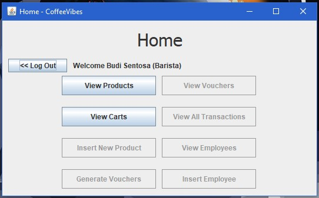

# CoffeeVibes
A system to manage a cafe’s business activity. This application can be used by many users with different employee position which are: Barista, Product Admin, Manager, and Human Resource Department. Each of these employee positions have different actions that they can do inside the application, for example Barista can only view products, and view carts, and do checkout. While Human Resource Departmet can add a new employee or fire existing one. CoffeeVibes was built using Java with MVC (Model View Controller) architecture, MySQL as database, and minimalizes human error with input validations.

# Startup Guide
1. Install XAMPP, then start Apache and MySQL module (make sure these two modules are active, otherwise the application can't connect to the database and won't start).
2. Go to http://localhost/phpmyadmin/.
3. Import the database from coffeevibesdb.sql file found in the repository.
4. Run CoffeeVibes on Eclipse or other Java-compatible IDE.

Below is the preview and/or flow of the application:
# (1/12) Login Page

Login page is to determine what feature is available to be used, depending on their position. Username and password input will then be checked by a query, if that user exists, it will redirect them to the home screen.

# (2/12) Home Page (as Barista)

Home page is where the user will land after logging in, based on your position, you will only be able to do a certain task, such as the picture above, where the user is a Barista, he can only View Products, and View Carts.

# (3/12) View Product Page (as Barista)

View Product page is split into two functionalities, the first one is Add to Cart, which is only available if the employee is a Barista. If you click the row of product, then fill the quantity of product, that product will be put in to the cart.

# (4/12) View Product Page (as Product Admin)

The second functionality of View Product page is to Delete and Update Product, available only to the Product Admin. If you click on a product row, it will automatically fill the text fields for Deletion or Updating.

# (5/12) View Cart Page

View Cart page is only available to Barista, where you can see products in the cart, and decide if you want to remove a certain product from cart, or if you want to check out the cart. Barista can also apply vouchers based on voucher ID before checking out but it’s optional, note that if you do, that voucher status will change from available to expired after you press the checkout button. After checking out, a new Transaction record will be created based on the cart’s content.

# (6/12) Insert New Product Page

Insert New Product page is available only for Product Admin, they can input a name, description, price, and stock, then press Insert Product to insert them into the database. This page also implements input validation such as cannot be empty, or price/stock has to be numerical, etc.

# (7/12) Generate Voucher Page

Generate Voucher page is only available for Product Admin, where they can input an integer value from 1-100, then press the button to generate a voucher.

# (8/12) View Vouchers Page

View Voucher page is the last page available for Product Admin, in here they can see the voucher’s status, how much is their discount rate, and their Id. On top of that if they click a row, they can decide to delete that voucher too by clicking the Delete Voucher button afterwards. Voucher with expired status can no longer be used during checkout.

# (9/12) View Transactions Page

View All Transaction page is available only for Manager, in here they can see all of the transactions that have occurred in Coffee Vibes application. On top of that, they can also click a row to see that transaction’s detail, such as what product was bought, how many, their price, and the subtotals. Note if a transaction didn’t use any voucher, it will just be shown as NULL.

# (10/12) View Employees Page (as Manager)

View Employees page is split into two, as a Manager, and as Human Resource Department. This one is for Manager. As a manager here, you can fire employees that you have selected in the table.

# (11/12) View Employees Page (as Human Resource Department)

View Employees page as Human Resource Department is the more complete version. Because not only can the fire employee, they can also update the employee’s information. Update Employee can be done after clicking the employee row on the table, editing their values, then clicking the Update Employee button. Only value not editable is the Employee ID and Position ID, because that could cause a mess of errors, also Position ID can’t be edited because the assignment didn’t ask it.

# (12/12) Insert New Employee Page

Insert Employee page is the last feature of this application, it can only be accessed by Human Resource Department. They can choose a position, then fill the name, salary, username, and password. Note that salary have to be numerical, and username must be unique (so the application doesn’t have more than one user using the same username).
